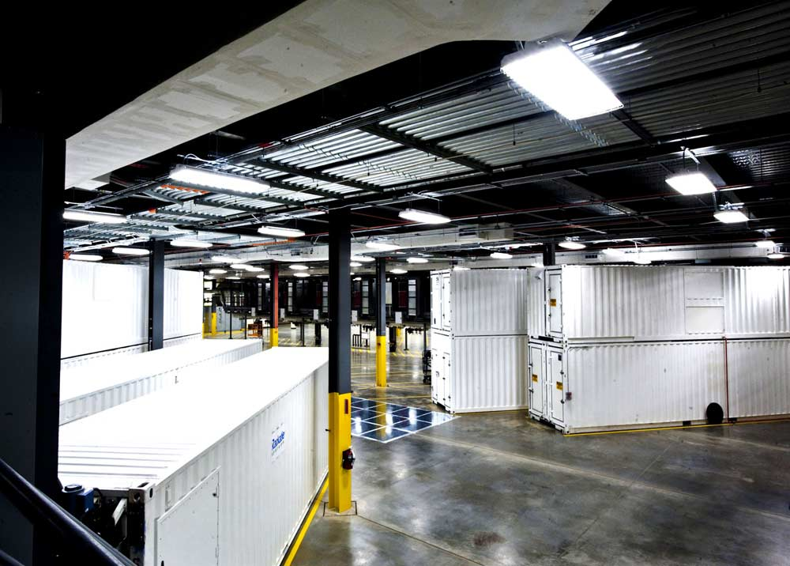

# Datacenter: sp20-516-251, Shihui Jiang

## Microsoft Chicago Northlake Data Center

:o2: my corrections have been overwritten you are not using git correctly

:o2: please learn markdown you have, special education is required

{#fig:Microsoft-Data-Denter}

:o2: use hashes for subsections

### Introduction

The company has engineered every inch of the 707,244-square-foot
facility for maximum efficiency.In 2009, Microsoft spent about $500
million to build a new data center in Northlake,IL to support their
increasing demand of online services.Northlake data center is one of the
most powerful data center developments in the
U.S[@sp-20-251-NorthLakeDataCenter].

### Electricity Cost and Carbon Footprint

The average commercial electricity rate in Northlake, IL is 4.05¢/kWh[@sp-20-251-ElectricityLocal].There are three 66 MVA electrical substations that provide a total of 198 megawatts of power[@sp-20-251-MicrosoftChicagoNorthlake].

198 megawatts * 1000 = 198000 kilowatts

Yearly Cost($) = Eelectricity Cost * IT Load(KW) = 0.0405*198000*365*24=$70,246,440.00

Based on the yearly cost, we use the carbon footprint calculator [link](
https://www.se.com/ww/en/work/solutions/system/s1/data-center-and-network-systems/trade-off-tools/data-center-carbon-footprint-comparison-calculator/) to get the CO2 Footprint which is approximately 578160 ton yearly 

### Renewable Energy

The world is facing carbon emission issues. With climate change and
global warming,carbon emission reduction has become the top priority for
technology giants. Microsoft has been playing a key role to reduce
carbon emission. By 2030 Microsoft will be carbon negative, and by 2050
Microsoft will remove from the environment all the carbon the company
has emitted either directly or by electrical consumption since it was
founded in 1975[@sp-20-251-Carbonnegative].

Renewal energy, also called future enegry. It derives from earth’s
natural resources, such as wind, ocean,etc. Which energy is the best
replacement for data centers to reduce carbon emission? I would say wind
energy. It's clean, free and most readily available renewable energy
source. As a clean fuel source, the usage of wind energy produces a
significant reduction in air pollution and is available in abundant
supply. Most notably, this form of power is one of the lowest-priced,
renewable energy technologies available today, costing users only four
to six cents per kilowatt-hour[@sp-20-251-WindEnergy]. Although, wind
energy might not suitable for all data centers based on location,
weather and capacity.

           

